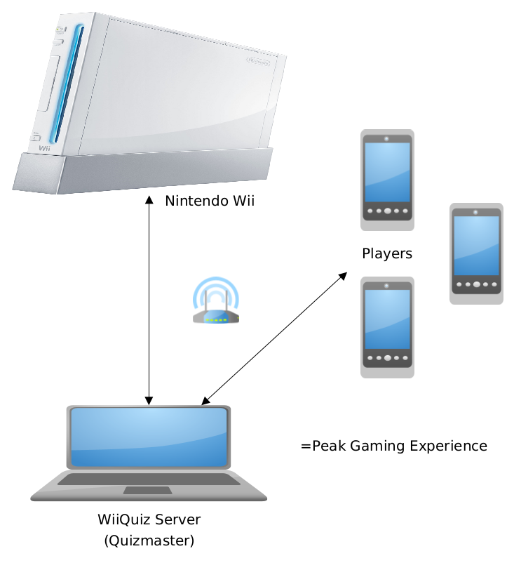

# WiiQuiz
A presentation, quiz and minigame engine for the Nintendo Wii :)



## Build Instructions
* install devkitpro: https://devkitpro.org/wiki/Getting_Started
  * make sure the environment variables ```DEVKITPRO``` and ```DEVKITPPC``` are set correctly to your devkitpro installation. This is required 
* install GRRLIB: https://github.com/GRRLIB/GRRLIB
* ```cd wiiquiz/ && make```

## Deployment Instructions
* Startup the quiz server (TODO link)
* ```WIILOAD=tcp:<wii ip> wiiload WiiQuiz.dol```

info: this project contains configuration for VSCode